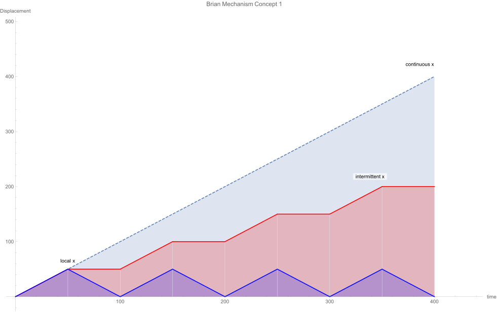
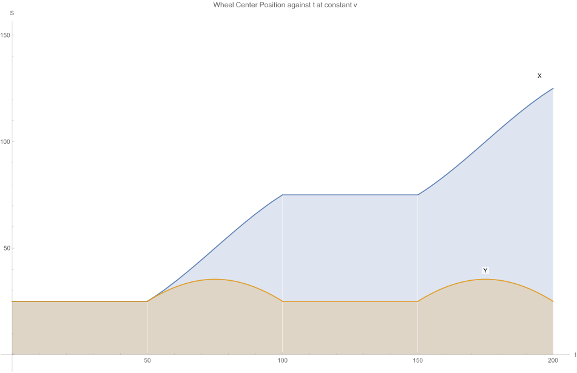

# Brian Mechanism

Brian Mechanism is the wheel reinvented to increase precision. It is a 1 DoF frame for turning a fixed robot into a precision compound robot thereby turning the small scale fixed robot into a large scale robot. The mechanism has been designed in answer to the challenge of creating a versatile, scalable robot which can be afforded by the Afrcan farmer. In this respect, it scores all the marks. Other proposed uses of it are:

| # | Industry | Application |
|---|----------|-------------|
|1| Agriculture | Planting, weeding, crop monitoring, irrigation, harvesting. Both small scale and large scale |
|2| Construction | Brick laying |
|3| Manufacturing | 3D printing, laser cutting, etc |

Other applications of the mechanism are left to the imagination of the creating mind,  including making fancy toys for children.

## The Wheel Reinveted:
Why would anyone need to reinvent the wheel? Reintenting the wheel is not always a worthless effort. The wheel was designed for moving its payload from one place to another with very low precision. It was not designed for precision robotics. It has the advantages of (1) speed, (2) energy efficiency since it does not move the payload vertically relative to the ground as some walking mechanisms do (3) scale: a wheel can go anywhere, unlike fixed robots. But due to slip, it does dismally on precision. You cannot tell a wheel to go 10 meters and stop at exactly that distance. It will slip along the way. So there have to be very complex control systems to correct the errors in its displacement if it has to be used in a precision robot. These control systems have within them equally complex sensor systems which go by such names as "sensor fusion", LIDAR, GPS, etc. Open loop control systems cannot be used here. This means that in robotics, wheels systems are expensive if used in precision robots.

Grouping robots into categories based on their mobility we have (1) fixed robots and (2) mobile robots. But the wheel, its advantages and disadvantages, is a model of the mobile robot since for the most part the mobility of a robot is achieved by putting it on wheels. Fixed robots on the other hand use a rigid structure to constrain the payload (on an end effector) to achieve the desired precision. The rigid structure is a highly and precisely machined material such as heavy thick steel or aluminium. But such materials do not come cheap. It is therefore economically impossible to scale a fixed robot to a reasonable size for several outdoor applications, such as for agriculture. The case of the [signal failure of Farmbot Max](https://farm.bot/blogs/news/putting-farmbot-genesis-max-and-express-max-on-hold) illustrates this well. Although cable systems may be obtained at a cheaper material cost so that they can cover a larger workspace, they also have a limit beyond which they cannot be extended.

Listed, the following are the advantages and disadvantages of mobile robots on wheels:

|Advantages | Disadvantages |
|-----------|---------------|
| Scalable. *Wheels can go anywhere* | Low precision  |
| High speed, *compared to walking mechanisms*         | Compelex control systems  |
| Simple design | Very expensive|

For a fixed robot we have:

|Advantages | Disadvantages |
|-----------|---------------|
| High precision | Not scalable |
| Open loop control possible| Unreasonably small scale for agricultural applications |
| Affordable when small in size | |

### The challenge
The challenge then is to create a fixed robot that is affordably scalable. This way we have the  precision of fixed robots and avoid the costs associated with mobile robots. The obvious way of doing this is by designing a compound robot. But since the fixed robot is already in place, the design work is reduced to that of a means of moving that rigid frame of a fixed robot from precisely from one point of reference to another. The small difference between this compound robot and a mobile robot is in the way the legs and moved in relation to the motion or the payload. In mobile robots continuous motion of the payload requires continuous motion of the actuating system which can be some set of legs or wheels. It is the motion of the actuating system that results in the displacement of the payload.

However, in the compound robot, there is no relation between the motion of the payload and the legs. For instance, continuous motion of the payload is accompanied by intermittent motion of the legs. This means that unlike in mobile robots where slip can occur at any time, in compound robots there is no slip when the robot is moving from one small workspace to the next. If a means can be devised for grounding the fixed robot frame down hard enough to overcome any slip that may be created when working, then the slip problem will have been solved. The frame can be grounded during its rest periods. This is where reinveting the wheel comes in. In agricultural applications, this can be achieved by increasing the weight of the robot to increase its static friction.

## Brian Mechanism Suggestions
We have two suggestions for achieving this type of motion:

1. The first is to use a wheel with a finite number of sides, say 4. When a torque is applied to the wheel, it turns about one of its edges, then rests on its side. It does not move again until the payload has moved a distance equal to the length of the side of the wheel. 

 

 

 

While this concept works in theory, it has the following drawbacks:
- The payload can only achiveve intermittent motion. Once the payload reaches the end of the frame carried by the wheels, it has to turn back and move back to the beginning of the frame. This happens as the wheel is turning. During this time, the payload does not move relative to the ground. 
- It is not energy efficient. The payload vertically during the turning of the wheel. Although this can be eliminated by putting the payload on a frame whose vertical position can be controlled to eliminate this, it increases the complexity of the system.

Notice that the motion of this type of wheel can be achieved by the a wheel that has spoked from the center of the wheel to the `n
` edges vertices. This is shown by the diagram below:

 

2. Two Backflipping frames

This system has two frames. In the beginning, one is upside down on top of the other. The lower frame is stationary. A pivot is formed on the right side of the frames to hold the upper frame to the lower frame and to allow the upper frame to turn about that point. As the payload moves, the upper frame turns 180° until it is right side up on the ground and when the payload goes beyond the workspace of the first frame, it gets into that of this second frame and is carried by it. About the same pivot, frame 1 turns 180° so that it lies upside down on top of frame 2. The pivot is now moved to the right side of the frames since the backflip has moved it to the left. The sequence continues so that frame 1 and frame 2 are alternately stationary and carrying the payload, one in front of the other and one on top of the other.

While this system is practical, if has the disadvantages of:
- The complexity of moving the pivoting system from one side of another, fixing one side while freeing the other.
- The large torque that would be required to turn the frame.
- The work down in lifting the frames is unnecessary. 
- Safety concerns incase the frame lifting system fails midway.
- Requires a large number of actuators

You can see these suggestions in action [here on youtube](https://youtu.be/zpdy7t51o8g). They are also in the [BrianMechanism-Concept Notebook](./BrianMechanism-Concept.nb)

## How we reinveted the wheel 
Our proprietary design solves these challenges.

It has features the desirable features:
1. Uses the actuator that drives the payload to move the wheel forward, thus reducing the cost.
2. Has the efficiency of a wheel.

Brian Mechanism as a wheel reinvented turns a fixed robot into a precision compound robot thereby turning a small scale fixed robot into a large scale robot with sufficient precision for use in agricultural applications.

It can also be used to build rope climbing and tree climbing robots. The model and simulation will be availed as soon as the legal work is done.